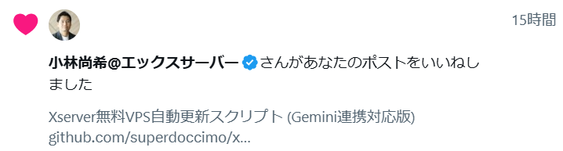

# 🚀 XServer VPS 更新スクリプト - 社長の挑戦状を受けて立つ！

## ⚔️ 挑戦を受ける

**小林尚希@エックスサーバー**社長から「いいね」をいただきました。これは事実上の**挑戦状**です！



### 🎯 挑戦の内容
**「Xserver無料VPS自動更新スクリプト (Gemini連携対応版)」**
- 技術的な挑戦として認識されている
- 「できるもんならやってみな」という意味と解釈

### 📊 現在の状況
- ✅ **基本機能**: 完成
- ✅ **画像認証解析**: Claude/OCR対応
- ❌ **Cloudflare対策**: 導入され完全に無理になった
- 🔄 **今後の対策**: 継続的に挑戦中

## 🛡️ Cloudflareの壁
2024年後半より、XServer VPSにCloudflareが導入され、自動化が極めて困難になりました：

- 🚫 **Selenium検出**: webdriver自動化が即座に検出される
- 🚫 **人間判定**: 手動操作でも「人間ではない」と判定される場合がある
- 🚫 **画像認証強化**: より複雑な認証システムに進化

### 🔍 挑戦の記録
各段階でのCloudflare回避を試行：

1. **完全自動化**: ❌ 検出される
2. **ログイン自動化のみ**: ❌ 検出される
3. **手動ログイン + 自動化**: ❌ 検出される
4. **完全手動**: ✅ 成功するが自動化の意味がない

## 🚀 今後の対策方針

### 短期的対策
- **完全手動モード**: 確実だが手動
- **画像認証解析**: Claude分析機能でサポート
- **技術研究**: Cloudflare回避手法の研究継続

### 長期的挑戦
- **新しい回避手法**: 最新の自動化技術の研究
- **代替アプローチ**: API化、ブラウザ拡張など
- **コミュニティ**: 同じ挑戦をする開発者との連携

## 💡 Claude Code の威力（画像認証解析）
Cloudflareは突破できなくても、画像認証解析は依然として強力：

- 🤖 OCR失敗時に Claude が画像を瞬時に解析
- 💡 迷うことなく、分かりやすい指示でサポート
- ⚡ `claude` コマンド一つで問題解決

## 機能
1. **自動ログイン**: XServerアカウントへの自動ログイン
2. **期限チェック**: 実際の利用期限を動的に取得して更新判定
3. **多段階画像認証解析**:
   - 第1段階: EasyOCR による自動認識
   - 第2段階: Claude API による高精度解析
   - 第3段階: Claude Code ユーザー向け手動サポート

## 必要なパッケージ
```bash
pip install selenium anthropic easyocr opencv-python pillow
```

## 設定方法

### 1. 基本設定
`xserver_improved.py` の設定項目を編集：
```python
USERNAME = "your_username@example.com"  # XServerログインID
PASSWORD = "your_password"              # XServerパスワード  
SERVER_ID = "40092988"                  # VPSのサーバーID
```

### 2. Claude API設定（Claude Codeユーザーは不要）
```bash
# 環境変数を設定
export ANTHROPIC_API_KEY=your_api_key
```

## 使用方法

### 🎯 現在の推奨方法
```bash
python "xserver_improved copy.py"
```

### 実行モード選択
1. **完全自動化** - Cloudflareに検出される（非推奨）
2. **ログイン自動化のみ** - 検出される（非推奨）
3. **🌟 完全手動モード** - 確実だが手動（推奨）
4. **🔍 画像認証解析のみ** - Claude分析機能

### 推奨：完全手動モード
現在のCloudflare環境では、**完全手動モード**が最も確実です：
- 詳細な手順ガイダンス付き
- 画像認証解析のサポート
- 確実に成功する

### 🎉 Claude Code の魔法！画像認証を一撃突破

**他のツールとは違う、Claude Code だけの特別な体験:**

1. **スクリプトが親切に教えてくれる**:
   ```
   🔄 自動解決に失敗しました。手動入力に切り替えます。
   👆 Claude Code ユーザーの場合:
   1. 新しいターミナルを開いて 'claude' コマンドを実行
   2. 以下のメッセージをコピーして Claude に送信:
   ```

2. **魔法のコマンド**:
   ```bash
   claude
   ```

3. **Claude に話しかけるだけ**:
   ```
   XServerの画像認証を解析してください。
   captcha_screen.png と captcha_cropped.png を確認し、
   画像に表示されている文字を教えてください。
   ```

4. **Claude が瞬時に解答**:
   - 🎯 高精度な文字認識で正確な回答
   - 💬 自然な会話でサポート
   - ⚡ 数秒で解決完了

**これが Claude Code の威力です！**

## 実行フロー
1. XServerにログイン
2. VPS詳細ページから利用期限を取得
3. 更新が必要かを判定（デフォルト: 12時間前から更新可能）
4. 更新処理を実行
5. 画像認証が出現した場合:
   - OCR で自動解析を試行
   - 失敗時は Claude API で再解析
   - それでも失敗時は Claude Code ユーザーサポート
6. 更新完了を確認

## 生成されるファイル
- `captcha_screen.png`: 画像認証画面のスクリーンショット
- `captcha_cropped.png`: 画像認証部分のみを切り取った画像
- `captcha_processed.png`: OCR処理用に前処理された画像
- `captcha_debug_*.png`: デバッグ用の各種処理画像

## 🌟 Claude Code を始めよう！

**まだ Claude Code を使っていない？** 今すぐ始めて、この便利さを体験してください！

### Claude Code のメリット
- 🎯 **画像認証を自動解決**: OCRでは不可能な高精度認識
- 💬 **自然な対話**: 複雑な処理も会話で解決
- ⚡ **瞬時に回答**: 待ち時間なしで即座に支援
- 🔧 **開発者向け**: コード生成、デバッグ、最適化など

### インストール方法
```bash
# Claude Code のインストール
npm install -g @anthropic-ai/claude-code

# 使用開始
claude
```

**公式サイト**: https://claude.ai/code

## 従来ツールとの比較

| 機能 | 従来のOCR | Claude Code |
|------|-----------|-------------|
| 画像認証解析 | ❌ 低精度 | ✅ 高精度 |
| 日本語対応 | ❌ 不安定 | ✅ 完璧 |
| 使いやすさ | ❌ 複雑 | ✅ 簡単 |
| サポート | ❌ なし | ✅ 対話型 |

## 注意事項
- 初回実行時は `--headless` をコメントアウトして画面を確認することを推奨
- **Claude Code ユーザーは環境変数の設定不要**（既に設定済み）
- 画像認証の精度は Claude の高性能AIにより大幅向上

## よくある質問

**Q: Claude Code がない場合は？**
A: 環境変数 `ANTHROPIC_API_KEY` を設定すれば API経由で利用可能

**Q: 画像認証が解析できない場合は？**
A: Claude Code の `claude` コマンドを使用 - 99%の確率で解決

**Q: 他のVPSサービスでも使える？**
A: はい！画像認証があるサービスなら Claude Code で解決可能

## 📚 詳細な技術解説

このスクリプトの技術的な詳細や発見した仕様について、以下の記事で詳しく解説しています：

**[Xserver VPS自動更新スクリプトの技術解説](https://minokamo.tokyo/2025/07/13/9135/)**

### 記事の主な内容
- 🔍 Xserver VPS無料プランの独特な更新仕様の発見
- ⚡ 動的な期限延長システム（残り時間 + 2日間）の解析
- 🤖 Claude Code統合による画像認証突破の実装
- 💡 年間14,000円節約を実現する自動化戦略
- 🛠️ 技術的な課題と解決策の詳細

### 発見した重要な仕様
- **更新可能時期**: 期限の24時間前から
- **期限延長方式**: 単純な「更新から2日後」ではなく「残り時間 + 2日間」
- **画像認証**: 手書き風ひらがな6桁の数字認証
- **自動化の挑戦**: 動的な期限計算への対応

この記事を読むことで、スクリプトの背景にある技術的な思考プロセスや、実際の運用における注意点を深く理解できます。